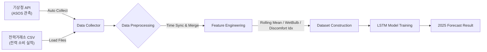

# ⚡ LSTM 기반 2025년 일일 최대 전력 수요 예측  
### End-to-End Data Pipeline & Deep Learning for Power Demand Forecasting

기상청 기상 데이터와 전력거래소 전력 소비 데이터를 결합하여  
2025년 일일 최대 전력 수요를 예측하는 LSTM 프로젝트.  

서로 다른 출처의 시계열 데이터를 통합하고,  
이상치에 강한 모델을 구축하여 **MAPE 4.49%**의 성능을 달성.

---

## 📋 프로젝트 개요

- **목표**: 2025년 전력 수급 안정을 위한 일일 최대 전력 수요 예측 모델 구현  
- **기간**: 2025.09 - 2025.12 (개인 프로젝트)  
- **핵심 성과**: MAPE(평균 절대 백분율 오차) **4.49%** 달성  
- **주요 기술**: Python, PyTorch (LSTM), Pandas, Request  

---

## 🛠️ 아키텍처 및 파이프라인 (Data Lineage)

데이터의 수집부터 모델 학습, 결과 예측까지 이어지는  
End-to-End 파이프라인 구축



---

## 💡 주요 기능 및 기술적 특징

### 1. 데이터 수집 및 정합성 확보 (`data_collector.py`)

- **API 타임아웃 예외 처리**  
  대용량 기상 데이터 요청 시 발생하는 연결 끊김 문제를 해결하기 위해  
  재시도(Retry) 로직을 구현하여 안정적인 데이터 수집 자동화

- **이기종 데이터 통합**  
  포맷이 다른 전력거래소 CSV 파일과 기상청 API(JSON) 데이터를 파싱하여  
  Timestamp 기준으로 정밀 매핑 및 병합

### 2. 피처 엔지니어링 (`utils.py`)

- 단순 기온 정보의 한계를 극복하기 위해 파생변수를 생성하여 예측력 향상

- **이동평균(Rolling Feature)**  
  - 과거 3일간 기온 추세를 반영하는 `T_avg_Roll3` 변수 생성

- **체감 지표(Weather Index)**  
  - 습구온도(WetBulb)  
  - 불쾌지수(Discomfort Index)  
  → 전력 소비에 직접적인 영향을 주는 기상 요소를 수식으로 구현

### 3. 모델 최적화 및 학습 안정성 (`model.py`, `train.py`)

- **Huber Loss 적용**  
  전력 수요 데이터 특성상 발생하는 급격한 피크 및 이상치에 대해  
  모델이 과도하게 반응하지 않도록  
  MSE 대신 Huber Loss를 손실 함수로 채택하여 학습 안정성 확보

- **Sliding Window 기반 시퀀스 구성**  
  시계열 데이터의 연속성을 학습할 수 있도록  
  입력 데이터를 고정 길이 시퀀스로 구성하여 LSTM 학습에 활용

---

## 📂 디렉토리 구조

```plaintext
├── data_collector.py   # 기상청 API 호출 및 전력 데이터 로드
├── utils.py            # 전처리, 파생변수 생성(Rolling 등), 데이터 병합
├── model.py            # PyTorch LSTM 모델 아키텍처 정의
├── train.py            # 모델 학습 및 가중치 저장 (HuberLoss 적용)
├── predict.py          # 2025년 데이터 생성 및 예측 수행
├── config.py           # 환경변수 로드 및 하이퍼파라미터 설정
├── requirements.txt    # 필요 라이브러리 목록
└── .env                # API Key
```

---

## 🚀 설치 및 실행 방법

### 1. 레포지토리 클론
```
git clone [https://github.com/ettyio/dailyPeakPowerDemandForecasting_usingLSTM.git](https://github.com/ettyio/dailyPeakPowerDemandForecasting_usingLSTM.git)
cd dailyPeakPowerDemandForecasting_usingLSTM
```

### 2. 라이브러리 설치
```
pip install -r requirements.txt
```

### 3. 환경 변수 설정
프로젝트 루트 경로에 .env 파일 생성하고 아래 내용 입력
```
WEATHER_API_KEY=발급받은_기상청_API_KEY
SERVICE_KEY=발급받은_서비스_키
```

### 4. 모델 학습 및 예측 수행
```
python predict.py
```

## 결과
Metric: MAPE (Mean Absolute Percentage Error)

Score: 4.49%

Visualization: 예측 결과 그래프는 forecast_plot_{current_time}.png로 저장.


